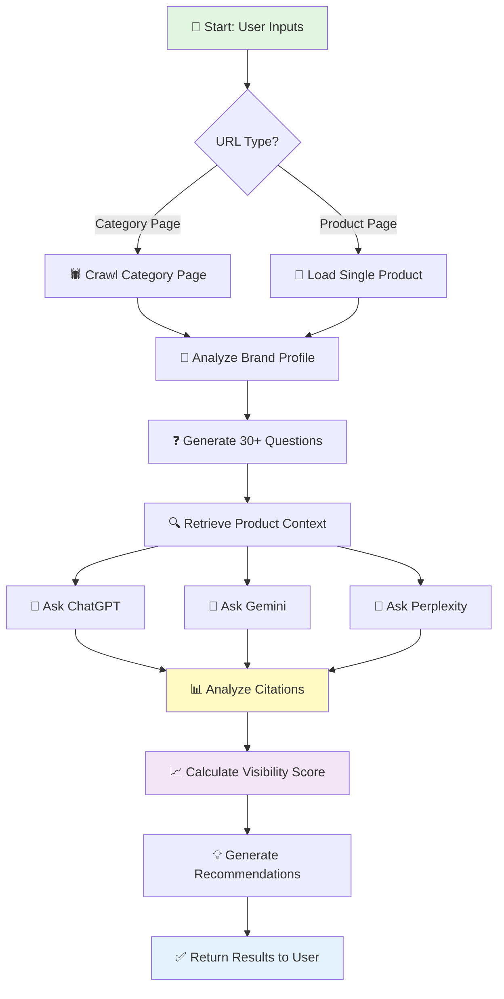

# 🎯 AISight - User Journey & Workflow

## Welcome to AISight! 👋

**AISight helps you discover how visible your brand is when people ask AI assistants (like ChatGPT, Google Gemini, or Perplexity) about products in your category.**

---

## 📊 The Simple 4-Step Process

```
┌─────────────────────────────────────────────────────────────────┐
│                                                                 │
│  🎯 STEP 1: Tell Us About Your Products                        │
│  ────────────────────────────────────────────────────────────  │
│                                                                 │
│  ▶ Share a URL to your product category page                   │
│    Example: yourstore.com/shoes/heels                          │
│                                                                 │
│  ▶ Or share a single product page                              │
│    Example: yourstore.com/products/red-stiletto-heels          │
│                                                                 │
│  ▶ Tell us what category it is                                 │
│    Example: "Women's High Heels"                               │
│                                                                 │
└─────────────────────────────────────────────────────────────────┘
                              ⬇️
┌─────────────────────────────────────────────────────────────────┐
│                                                                 │
│  🤖 STEP 2: We Analyze Your Products (Automated)               │
│  ────────────────────────────────────────────────────────────  │
│                                                                 │
│  ✓ We discover all products on your page                       │
│  ✓ We understand your target customers                         │
│  ✓ We learn about your brand positioning                       │
│  ✓ We identify your product features                           │
│                                                                 │
│  ⏱️ This takes about 30-60 seconds                             │
│                                                                 │
└─────────────────────────────────────────────────────────────────┘
                              ⬇️
┌─────────────────────────────────────────────────────────────────┐
│                                                                 │
│  ❓ STEP 3: We Generate Real Customer Questions                │
│  ────────────────────────────────────────────────────────────  │
│                                                                 │
│  We create 30+ realistic questions that your potential          │
│  customers might ask AI assistants, like:                       │
│                                                                 │
│  💭 "Best high heels for all-day comfort?"                     │
│  💭 "Affordable designer heels under $150"                     │
│  💭 "Where to buy stylish heels online?"                       │
│  💭 "How to choose the right heel height?"                     │
│                                                                 │
│  These questions cover the entire customer journey:             │
│  🔍 Discovery → 🤔 Research → 🛒 Purchase                      │
│                                                                 │
└─────────────────────────────────────────────────────────────────┘
                              ⬇️
┌─────────────────────────────────────────────────────────────────┐
│                                                                 │
│  🎯 STEP 4: We Ask AI & Measure Your Visibility                │
│  ────────────────────────────────────────────────────────────  │
│                                                                 │
│  For each question, we ask:                                     │
│                                                                 │
│  🤖 ChatGPT        "Does it mention your brand?"               │
│  🤖 Google Gemini  "How often is your brand cited?"            │
│  🤖 Perplexity     "Is your brand recommended?"                │
│                                                                 │
│  Then we calculate:                                             │
│                                                                 │
│  📈 Your overall brand visibility score                        │
│  📊 Which AI mentions you most                                 │
│  🎯 Which questions trigger brand mentions                     │
│  💡 Insights on improving visibility                           │
│                                                                 │
└─────────────────────────────────────────────────────────────────┘
                              ⬇️
┌─────────────────────────────────────────────────────────────────┐
│                                                                 │
│  📈 YOUR RESULTS: Actionable Brand Visibility Report           │
│  ────────────────────────────────────────────────────────────  │
│                                                                 │
│  ✅ Overall Visibility Score: 45%                              │
│                                                                 │
│  ✅ Best Performing AI:                                        │
│     • ChatGPT: 56% mention rate                                │
│     • Gemini: 43% mention rate                                 │
│     • Perplexity: 37% mention rate                             │
│                                                                 │
│  ✅ Top Performing Question Types:                             │
│     • Purchase intent queries: 62% visibility                  │
│     • Comparison queries: 48% visibility                       │
│     • Discovery queries: 31% visibility                        │
│                                                                 │
│  ✅ Recommendations to Improve                                 │
│                                                                 │
└─────────────────────────────────────────────────────────────────┘
```

---

## 🎨 Visual User Journey

### From Start to Insights in 3 Minutes

```
👤 YOU                          🤖 AISIGHT                      📊 RESULTS
────────────────────────────────────────────────────────────────────────

1️⃣ INPUT YOUR INFO

   📝 Product Category URL      ──▶  🔍 Discover Products
   📝 Product Category Name          🧠 Analyze Brand
   📝 Target Audience (optional)     📋 Profile Customers


2️⃣ WE DO THE WORK (2-3 min)

                                    ❓ Generate 30+ Questions
                                    🤖 Ask ChatGPT/Gemini/Perplexity
                                    🔬 Analyze Responses
                                    📊 Calculate Visibility


3️⃣ GET YOUR INSIGHTS

                                                              📈 Visibility Score
                                                              📊 AI Breakdown
                                                              🎯 Top Queries
                                                              💡 Recommendations
                                                              📥 Full Report (JSON)
```

---

## 🛤️ Detailed User Flow

### Option 1: Category URL Analysis (Most Common)

```
START
  │
  ├─▶ 1. Paste category page URL
  │     Example: "yourstore.com/women-heels"
  │
  ├─▶ 2. Enter product category
  │     Example: "Women's High Heels"
  │
  ├─▶ 3. Provide API keys
  │     • OpenAI (required)
  │     • Google Gemini (optional)
  │     • Perplexity (optional)
  │
  ├─▶ 4. Click "Analyze"
  │
  ├─▶ 5. Watch Real-time Progress
  │     ⏳ Discovering products...
  │     ⏳ Learning about brand...
  │     ⏳ Generating questions...
  │     ⏳ Asking AI assistants...
  │     ⏳ Analyzing responses...
  │
  └─▶ 6. View Results Dashboard
        📊 Visibility metrics
        🎯 Top performing queries
        💡 Improvement suggestions
```

### Option 2: Single Product Analysis

```
START
  │
  ├─▶ 1. Paste product page URL
  │     Example: "yourstore.com/products/red-stiletto-heel"
  │
  ├─▶ 2. Select "Product" type
  │
  ├─▶ 3. System auto-extracts:
  │     • Product name
  │     • Product description
  │     • Product category
  │
  ├─▶ 4. Provide API keys
  │
  ├─▶ 5. Click "Analyze"
  │
  ├─▶ 6. Get Product-Specific Report
        📊 How visible is THIS product?
        🎯 Which questions mention it?
        💡 How to improve visibility?
```

---

## 🎯 What You Get: Results Explained

### 1. **Overall Visibility Score**
```
45% Visibility Score
═══════════════════════════════════════

What this means:
✓ 45% of AI responses mention your brand
✓ Industry average is 30-40%
✓ Top performers achieve 60-70%

Your Status: Above Average ⭐
```

### 2. **AI-by-AI Breakdown**
```
ChatGPT      ████████████░░░░  56%  (17/30 mentions)
Gemini       ███████████░░░░░  43%  (13/30 mentions)
Perplexity   █████████░░░░░░░  37%  (11/30 mentions)
```

### 3. **Question Type Performance**
```
Purchase Intent   ██████████████░░  62%  "Where to buy..."
Comparison        ████████████░░░░  48%  "Brand X vs..."
Discovery         ████████░░░░░░░░  31%  "Best options for..."
How-to Guides     ██████░░░░░░░░░░  25%  "How to choose..."
```

### 4. **Sample Winning Queries**
```
✅ High Visibility Questions (Your brand mentioned often):
   • "Best heels for office professionals" - 100% mention rate
   • "Affordable designer heels under $150" - 67% mention rate

❌ Low Visibility Questions (Opportunities to improve):
   • "How to style heels for different occasions" - 0% mention rate
   • "Sustainable heel brands" - 0% mention rate
```

### 5. **Actionable Recommendations**
```
💡 Opportunity #1: Create content about "sustainable heels"
   → 0% visibility for eco-conscious queries

💡 Opportunity #2: Optimize for "styling guides"
   → Educational content gets low brand mentions

💡 Opportunity #3: Target "professional wear" niche
   → 100% visibility - double down on this audience
```

---

## 📱 Simple API Request Example

### All You Need to Send:

```json
{
  "brand_name": "Novo Shoes",
  "brand_url": "https://novoshoes.com/heels",
  "url_type": "category",
  "product_category": "Women's High Heels",
  "k": 30,
  "api_keys": {
    "openai_api_key": "sk-your-key-here"
  }
}
```

### What You Get Back:

```json
{
  "overall_brand_visibility": {
    "average_citation_percentage": 45.5,
    "total_queries": 30,
    "queries_with_citations": 18
  },
  "llm_breakdown": {
    "ChatGPT": {"citation_percentage": 56.7},
    "Gemini": {"citation_percentage": 43.3},
    "Perplexity": {"citation_percentage": 36.7}
  },
  "intent_breakdown": {
    "purchase": {"citation_percentage": 62.5},
    "comparison": {"citation_percentage": 48.2},
    "discovery": {"citation_percentage": 31.0}
  }
}
```

---

## ⏱️ Timeline: What to Expect

```
0:00 ─────────▶ 0:30 ─────────▶ 1:30 ─────────▶ 2:30 ─────────▶ 3:00
  │               │               │               │               │
  │               │               │               │               │
START          PRODUCTS        QUESTIONS      AI ANALYSIS      RESULTS
Submit         Discovered      Generated      Complete         Ready
Request        & Indexed       (30+ queries)  (90+ AI calls)
```

**Total Time: ~2-3 minutes** for 30 queries across 3 AI platforms

---

## 🎓 Understanding the Metrics

### What is "Brand Visibility"?
> **Simple:** Out of 30 realistic customer questions, how many times do AI assistants mention YOUR brand in their answers?

### Why Does This Matter?
- 📱 **46% of product searches** now start with AI assistants (2024 data)
- 🛒 **68% of consumers** trust AI recommendations for purchases
- 📈 **Higher AI visibility = More traffic & sales**

### What's a Good Score?
- ✅ **60%+** - Excellent (Industry leader)
- ✅ **40-60%** - Good (Above average)
- ⚠️ **20-40%** - Fair (Room for improvement)
- ❌ **<20%** - Needs work (Optimize urgently)

---

## 🚀 Use Cases

### 1. **Brand Health Check**
> "How visible is my brand when customers ask AI?"

### 2. **Competitive Analysis**
> "Do AI assistants recommend us vs competitors?"

### 3. **Content Strategy**
> "Which topics should we create content for?"

### 4. **SEO for AI Era**
> "Optimize for AI recommendations, not just Google"

### 5. **Marketing ROI**
> "Track AI visibility improvements over time"

---

## 🎯 Quick Start Checklist

```
□ 1. Get your OpenAI API key (https://platform.openai.com/api-keys)
□ 2. Find your product category URL or product page
□ 3. Identify your product category (e.g., "Women's Shoes")
□ 4. Make API request (see example above)
□ 5. Wait 2-3 minutes
□ 6. Review results & insights
□ 7. Take action on recommendations
```

---

## 📞 Need Help?

### Common Questions:

**Q: How long does analysis take?**
A: 2-3 minutes for 30 queries across all AI platforms

**Q: Can I analyze multiple product categories?**
A: Yes! Just make separate requests for each category

**Q: Do I need all three AI API keys?**
A: No, OpenAI is enough. More APIs = more comprehensive results

**Q: How often should I check visibility?**
A: Monthly recommended, or after major content/SEO changes

**Q: Can I use my own custom questions?**
A: Yes! Provide pre-defined queries instead of auto-generation

---

## 🎨 Visual Flow Diagram (Mermaid)



---

## 🌟 Success Story Example

```
BEFORE AISight:
❌ Unknown AI visibility
❌ Guessing at content strategy
❌ No AI optimization

→ RAN AISIGHT ANALYSIS
   Discovered: 28% visibility (below average)
   Found: "Sustainable" queries had 0% visibility
   Insight: Competitors dominate eco-conscious searches

→ TOOK ACTION
   ✓ Created sustainability content
   ✓ Updated product descriptions
   ✓ Optimized for eco keywords

AFTER 3 MONTHS:
✅ 52% AI visibility (up 24 points!)
✅ #1 for "sustainable heels" searches
✅ 35% increase in organic traffic from AI-referred users
```

---

**Ready to discover your AI visibility?** 🚀

Just send a POST request to `/analyze` with your product URL and category!
